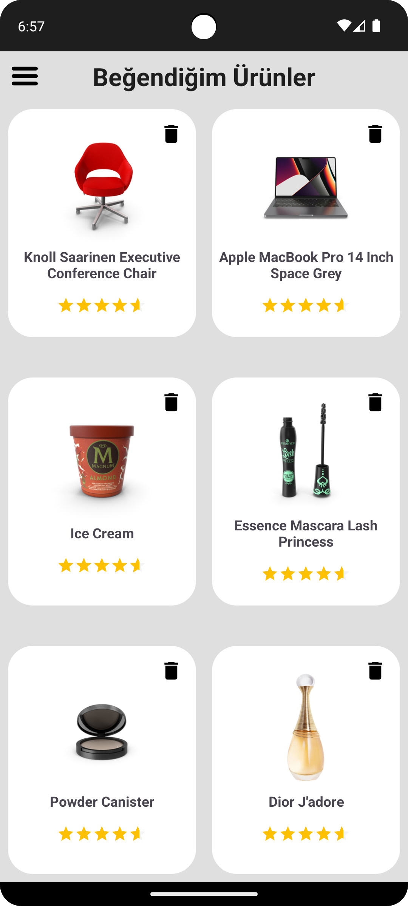

# Kotlin E-Commerce App

This project is an e-commerce application developed using Kotlin, leveraging a multi-module structure and various modern Android technologies and libraries.

## Introduction

The Kotlin E-Commerce App is designed to provide a seamless shopping experience. It features a multi-module architecture, ensuring a scalable and maintainable codebase. The app is built with both Jetpack Compose and XML for UI components, and includes advanced features like push notifications, data storage, and network communication.

## Screenshots

<p align="center">
 
 
 
 
 
 
 
 
 
 
 


</p>

## Technologies Used

The project utilizes several modern technologies and libraries to provide a robust and efficient solution. Here are the key technologies used:

- **Jetpack Compose**:
- **XML**
- **Navigation Drawer**:
- **Lottie**
- **Glide**
- **Push Notification**
- **Room**
- **MVVM** 
- **Hilt**
- **Coroutines**
- **Keystore**
- **Retrofit**
- **Clean Architecture**
- **Data Store**
- **Pagination**
- **Viewpager**
- **Gson**
- **Firebase Remote Config**
- **Firebase FCM**
- **Authentication With Jwt**
## Installation

To install and run the Kotlin E-Commerce App, follow these steps:

1. Clone the repository:
    ```sh
    git clone https://github.com/yourusername/kotlin-ecommerce-app.git
    ```
2. Open the project in Android Studio.
3. Sync the project with Gradle files.
4. Build and run the project on an Android device or emulator.

## Usage

Once the application is installed, you can use it to browse products, add items to your cart, and complete purchases. Additional features include viewing order history and receiving push notifications for special offers.

## Features

- **Multi-module architecture** for better organization and scalability.
- **Jetpack Compose and XML** for building UI components.
- **Push notifications** to keep users informed about special offers.
- **Room database** for local data storage.
- **Hilt for dependency injection** to manage dependencies.
- **Firebase Authentication** for secure user login.
- **Pagination** for efficiently loading large datasets.

## Dependencies

Ensure these dependencies are included in your `build.gradle.kts` file:

```kotlin
dependencies {
    implementation(libs.androidx.core.ktx)
    implementation(libs.androidx.appcompat)
    implementation(libs.material)
    implementation(libs.androidx.activity)
    implementation(libs.androidx.constraintlayout)
    implementation(libs.firebase.config)
    implementation(libs.firebase.messaging.ktx)
    implementation(libs.androidx.recyclerview)
    implementation(libs.androidx.gridlayout)
    testImplementation(libs.junit)
    androidTestImplementation(libs.androidx.junit)
    androidTestImplementation(libs.androidx.espresso.core)

    // Navigation component
    val nav_version = "2.7.7"
    implementation("androidx.navigation:navigation-fragment-ktx:$nav_version")
    implementation("androidx.navigation:navigation-ui-ktx:$nav_version")

    // Dagger Hilt
    implementation("com.google.dagger:hilt-android:2.51.1")
    kapt("com.google.dagger:hilt-compiler:2.51.1")

    // Room
    implementation("androidx.room:room-runtime:2.6.1")
    kapt("androidx.room:room-compiler:2.6.1")
    implementation("androidx.room:room-ktx:2.6.1")

    // Lifecycle components
    implementation("androidx.lifecycle:lifecycle-livedata-ktx:2.8.2")
    implementation("androidx.lifecycle:lifecycle-viewmodel-compose:2.8.2")
    implementation("androidx.lifecycle:lifecycle-viewmodel-ktx:2.8.2")
    implementation("androidx.lifecycle:lifecycle-extensions:2.2.0")
    implementation("androidx.lifecycle:lifecycle-runtime-ktx:2.8.2")

    // Retrofit
    implementation("com.squareup.retrofit2:retrofit:2.11.0")
    implementation("com.squareup.retrofit2:converter-gson:2.11.0")

    // OkHttp
    implementation("com.squareup.okhttp3:okhttp:4.9.1")
    implementation("com.squareup.okhttp3:logging-interceptor:4.9.1")

    // Glide
    implementation("com.github.bumptech.glide:glide:4.12.0")
    annotationProcessor("com.github.bumptech.glide:compiler:4.12.0")

    // Coroutines
    implementation("org.jetbrains.kotlinx:kotlinx-coroutines-core:1.8.0")
    implementation("org.jetbrains.kotlinx:kotlinx-coroutines-android:1.8.0")

    // SwipeDecorator
    implementation("it.xabaras.android:recyclerview-swipedecorator:1.4")

    // Keystore (Crypto library)
    implementation("androidx.security:security-crypto:1.1.0-alpha06")

    // Compose
    implementation("androidx.activity:activity-compose:1.9.0")
    implementation("androidx.compose.ui:ui:1.6.8")
    implementation("androidx.compose.material:material:1.6.8")
    implementation("androidx.compose.ui:ui-tooling-preview:1.6.8")
    debugImplementation("androidx.compose.ui:ui-tooling:1.6.8")
    implementation("androidx.compose.runtime:runtime-livedata:1.6.8")
    implementation("androidx.compose.runtime:runtime:1.6.8")
    implementation("androidx.lifecycle:lifecycle-runtime-compose:2.8.2")
    implementation("androidx.compose.runtime:runtime-rxjava2:1.6.8")

    // Lottie Animation
    implementation("com.airbnb.android:lottie:6.0.0")
}